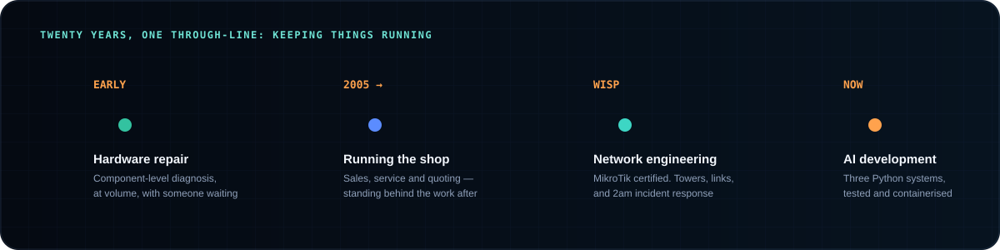
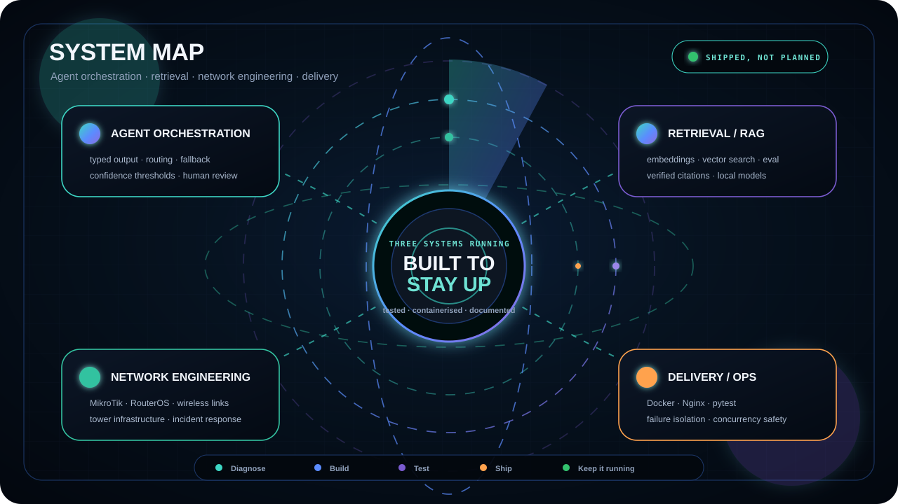

 

---

## Positioning

> I build **AI systems that survive contact with real users** — agent orchestration, retrieval pipelines, and the operational plumbing around them.

Twenty years repairing hardware and running a wireless ISP taught me what breaks and who it hurts. I write software with those assumptions built in: dependencies fail, users send unexpected input, and someone has to fix it at 2am with only the logs to go on.

Everything below is running code. Every number comes from the repository it describes.

---

## Engineering identity

<table>
<tr>
<td width="50%">

### Agentic systems
- LLM agents with typed, validated output
- Classification, routing and hand-off between agents
- Confidence thresholds with human review
- Provider fallback chains for outages and quota limits
- Prompt injection defence in layers
- Prompt iteration driven by observed failures

</td>
<td width="50%">

### Retrieval and RAG
- Chunking, embeddings and vector search
- Citation verification against retrieved evidence
- Rule-based filtering where embeddings can't discriminate
- Hybrid retrieval: SQL for counts, vectors for context
- Offline operation on local models
- Evaluation sets with measured pass rates

</td>
</tr>
<tr>
<td width="50%">

### Backend engineering
- Python, FastAPI and Flask
- SQLAlchemy 2.0 and SQLite
- Concurrency safety and atomic writes
- Failure isolation between stages
- Background tasks and webhook handling
- REST APIs with generated documentation

</td>
<td width="50%">

### Network and infrastructure
- MikroTik and RouterOS, certified
- Wireless ISP links, towers and customer connections
- Incident diagnosis and response under pressure
- Docker and Docker Compose, Nginx
- Component-level hardware repair
- Test-first delivery with pytest

</td>
</tr>
</table>

---

## Experience

  

---

## System map

  

---

## Tech stack

### Languages

### AI and retrieval

### Backend

### Data

### Delivery and operations

### Networking

---

## Proof of work

Not a list of skills — three repositories you can clone and run.

| Project | Stack | Evidence |
|---|---|---|
| **[Ticket triage agent](https://github.com/thuyamaungg/customer-support-ticket-triage-agent)** | FastAPI, pydantic-ai, SQLAlchemy 2.0 | 145 tests passing · ticket numbering verified under 50 concurrent threads · 6 channels behind one interface |
| **[WISP monitoring assistant](https://github.com/thuyamaungg/rag-based-wisp-monitoring-assistant)** | ChromaDB, sentence-transformers, Ollama, Docker | 20 of 21 evaluation questions passing · 164 indexed chunks · runs offline with zero API keys |
| **[Burmese troubleshooting chatbot](https://github.com/thuyamaungg/Burmese-PC-Troubleshooting-Chatbot)** | Flask, SQLite, Gemini, Docker Compose, Nginx | 169 tests · 92% backend coverage · 150 curated entries · bilingual |

**What's inside them that isn't obvious from the stack:**

- Ticket numbers allocated by atomic upsert, so two requests can never collide
- Customer text treated as untrusted across four layers, ending in a typed schema
- Every RAG citation verified against the evidence actually retrieved
- Rule-based date filtering where embeddings can't tell two near-identical log days apart
- Curated answers kept separate from generated ones, so the model can never overwrite what was checked by hand

---

## Capability map

  

---

## Credentials

**MikroTik certified** — router configuration, routing and wireless links.

**IBM Developer Skills Network, via Coursera** — including the Generative AI for Cybersecurity Professionals specialization, Building Generative AI-Powered Applications with Python, Python for Data Science and AI, and Prompt Engineering.

---

## Role alignment

Open to full-time roles and freelance work. Burmese, Thai and English.

---

## Connect

---

